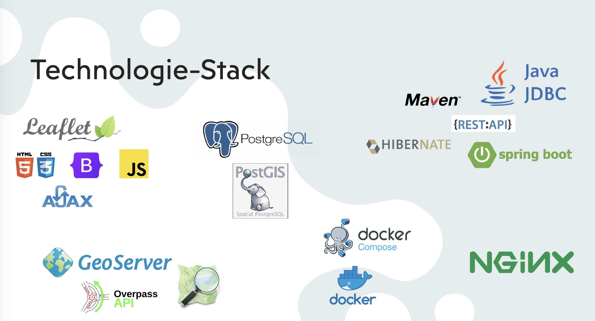
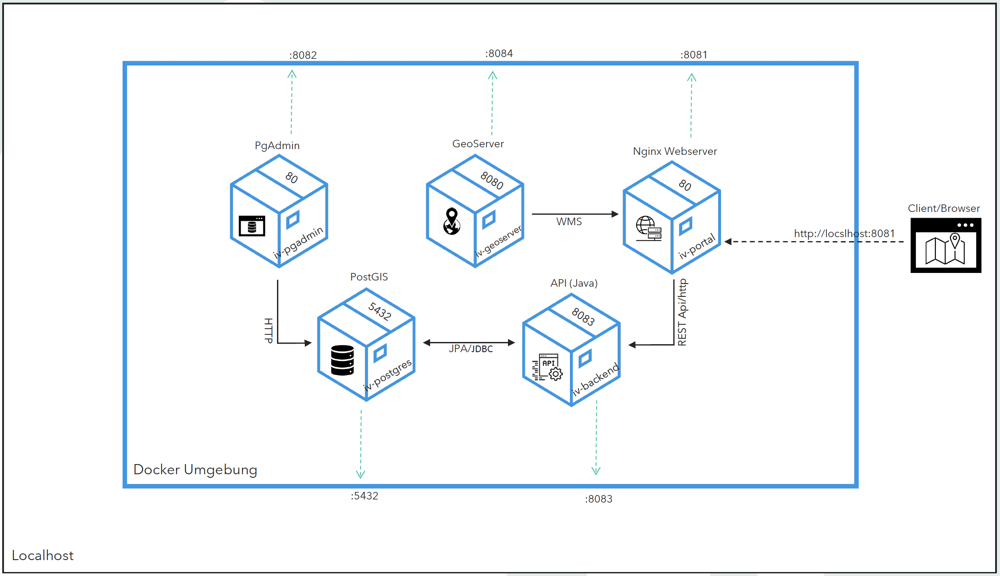

# EcoMaps

Eine interaktive Karte für umweltbewusste Fahrradfahrer*innen, die ein Elektroauto besitzen und Nachhaltigkeit und Komfort kombinieren möchten.

Die Karte zeigt Ihnen die besten Orte zum Parken und Aufladen Ihres Elektrofahrzeugs, während Sie mit dem Fahrrad durch die Stadt fahren. Sie können auch auf die Karte sehen, wo Sie in der Nähe ein Fahrrad ausleihen können. Außerdem können Sie nach Radwegen suchen, die speziell für Elektrofahrräder geeignet sind, um Ihre Fahrt so angenehm und effizient wie möglich zu gestalten.

Das Projekt umfasst die Entwicklung einer interaktiven Visualisierungslösung, die verschiedene Komponenten umfasst. Diese Komponenten arbeiten zusammen, um Daten aus einer PostGIS-Datenbank, Geoserver und weitere Quellen abzurufen und über eine webbasierte Benutzeroberfläche darzustellen.


## Installation

Folgende Schritte sind erforderlich, um das Projekt lokal auszuführen:

1. Stelle sicher, dass [Docker und Docker Compose](https://docs.docker.com/desktop/) auf deinem System installiert sind.
2. Klone das Projekt-Repository von GitHub: `git clone https://github.com/liRahimpour/intervisuell.git`
3. Gehe in das Projektverzeichnis: `cd intervisuell/iv-dev-dockercompose`
4. Führe das BashScript `build.sh` aus


## Komponentendokumentation

### Backend

Das Backend wurde mit Java Spring Boot, Hibernate und Maven entwickelt. Es stellt zwei Endpunkte bereit, die Daten aus der PostGIS-Datenbank abrufen und als JSON an das Frontend weitergeben. Die Endpunkte sind wie folgt erreichbar:

Module: [intervisuell](/intervisuell)
- Endpoints:
  - http://localhost:8083/api/v1/bike_rentals
  - http://localhost:8083/api/v1/charging_stations

### PostgreSQL

Module: [iv-dev-postgres](/iv-dev-postgres)

Die Datenbank basiert auf PostgreSQL und verwendet die PostGIS-Erweiterung. Sie enthält zwei Tabellen: "Bike_rental" und "Charging_station". Die Datenbank ist über den Port 5432 erreichbar.
- Host: localhost
- POSTGRES_USER=`admin`
- POSTGRES_PASSWORD=`admin`
- POSTGRES_DB=`db`
- Port: `5432`
- 
### Geoserver

Module: [iv-geoserver](/iv-geoserver)

Der Geoserver beinhaltet drei Overlays, die in der Visualisierung verwendet werden. Er ist über den Port 8084 erreichbar.
- Overlay:
```
const fahrradverleih = L.tileLayer.wms('http://localhost:8084/geoserver/wms', {
  layers: 'mainz:fahrradverleih',
  format: 'image/png',
  minZoom: 1,
  maxZoom: 20,
  transparent: true,
  icon: myIcon,
  attribution: '... </a>'
});

const fahrradwege = L.tileLayer.wms('http://localhost:8084/geoserver/wms', {
  layers: 'mainz:Radwege',
  format: 'image/png',
  minZoom: 1,
  maxZoom: 20,
  transparent: true,
  attribution: '... </a>'
}).addTo(map);

const supermarkt = L.tileLayer.wms('http://localhost:8084/geoserver/wms', {
  layers: 'mainz:Supermarkt',
  format: 'image/png',
  minZoom: 1,
  maxZoom: 20,
  transparent: true,
  attribution: '... </a>'
});
  ```
- Zugriff über: http://localhost:8084/geoserver/web/

### pgAdmin

Module: [wird über dockercompose Datei deployt unter services -> intervisuell-pgadmin](/iv-dev-dockercompose/docker-compose.yml)
Das Datenbankmanagementsystem pgAdmin wird verwendet, um die PostgreSQL-Datenbank zu initialisieren und zu verwalten. Es kann über den Port 8082 erreicht werden.
- Zugriff über: http://localhost:8082
- Username: `admin@admin.com`
- Password: `admin`

### Portal

Module: [iv-portal](/iv-portal)

Das Portal ist ein Nginx-Webserver, der die HTML-, CSS- und JavaScript-Dateien für die Benutzeroberfläche enthält. Es ist über den Port 8081 erreichbar.
- Zugriff über: http://localhost:8081

### Deployment (Docker Compose) 

Module: [iv-dev-dockercompose](/iv-dev-dockercompose)

Docker Compose ist ein Werkzeug ([Container-Orchestrierung](https://www.redhat.com/de/topics/containers/what-is-container-orchestration)), mit dem man mehrere Docker-Container zu einer Anwendung zusammenfassen können. Mit einer einzigen Konfigurationsdatei, die als "[docker-compose.yml](iv-dev-dockercompose/docker-compose.yml)" bezeichnet wird, kann man die Container, ihre Konfiguration und ihre Abhängigkeiten definieren.

Die Konfigurationsdatei ermöglicht es Ihnen, Container mit verschiedenen Images, Umgebungsvariablen, Netzwerkeinstellungen, Volumes etc. zu erstellen. Man kann auch die Kommunikation und Abhängigkeiten zwischen den Containern festlegen.

### Screencast und Abgabe

Module: [Abgabe-Ordner](/iv-doc)

- [Build Prozess Screencast](https://drive.google.com/file/d/1JooDVqHsKrsUFiw8UiG6pjmmFccEeMzY/view?usp=sharing)
- [Komponente Screencast](https://drive.google.com/file/d/1_Bk4ipjtd0385tca2hWKfGBUKiZ8Am1-/view?usp=sharing)
- [EcoMap Screencast](https://drive.google.com/file/d/11bwabLYI_fcYr2oA5TQXWuzrBbVN8NNZ/view?usp=sharing)


## Lizenz

Das Projekt wurde im Rahmen des Fachs "Interaktive Visualisierung und Internet" an der Hochschule Mainz entwickelt.


